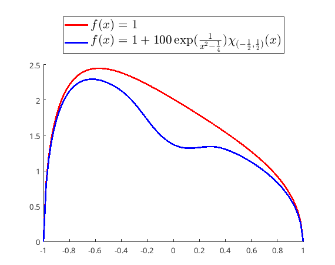
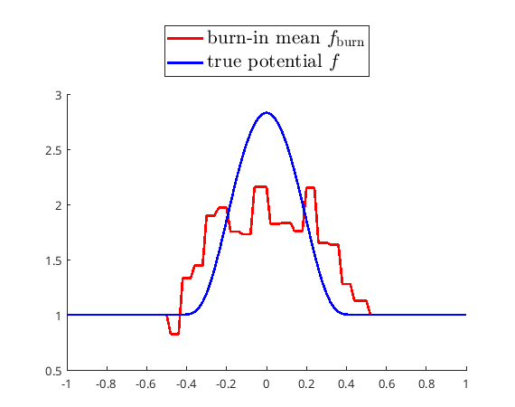
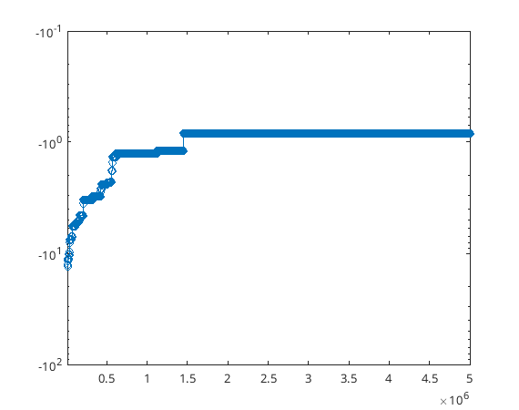

> [!NOTE] 
> For proper equation rendering, please view this documentation in day mode instead of night mode.

This repository provides the MATLAB implementation of the MCMC algorithm presented in the following paper: 

[Pu-Zhao Kow](https://puzhaokow1993.github.io/homepage/), [Janne Nurminen](https://users.jyu.fi/~jasanurm/) and [Jesse Railo](https://sites.google.com/view/jesserailo), *Bayesian inference for the fractional Calderón problem with a single measurement*, manuscript 

We will not going to explain all notations here, please refer to our paper for more details. 

Let  be a bounded smooth domain in , and let ^{s}) denote the fractional Laplacian of order ). 
We fix any ) with , and consider the following Dirichlet problem: 

  
^s+f)u=0) in  with , 

It is well-known that the potential  from the Dirichlet-to-Neumann map (DN map) 

  
:=\Lambda_{f}\phi\equiv(-\Delta)^{s}u_{f}|_{\mathcal{D}}), 

where  is a fixed open set. Owing to computational complexity, we consider only the case when . Some numerical examples are provided in figure below. 

 

We adopt a Bayesian approach to this problem, providing not only rigorous theoretical justifications but also supporting numerical simulations. 
We randomly choose  points  from a uniform distribution on  and measure 

(x_{i})+{\rm%20noise}). 

# Algorithm # 

**Require:** an initial guess }) and a resolution parameter })

1. Set ={\rm%20accept})
2. Creating an empty sequence )_{\tau=1}^{\infty})
3. **for  do**
4. $~~~~$ Generate =\sum_{r=-2^{J_0}}^{2^{J_0-1}}f_{r}\chi_{(0,1)}(2(2^{J_0}x-r))) with randomly chosen )
5. $~~~~$ Propose }=1+\sqrt{(1-\beta^2)}(f^{(\tau)}-1)+\beta%20f)
6. $~~~~$ **if ={\rm%20accept}) then**
7. $~~~~~~~~$ }(F^{(\tau)})), where }(f)=-\frac{1}{2\sigma^2}\sum_{i=1}^{N}(y_{i}-G(f)(x_{i}))^{2}) is the log-likelihood function 
8. $~~~~$ **end if**
9. $~~~~$ **if }(f^{(\tau+1)})>\ell_{\rm%20current}) then**
10. $~~~~~~~~$ Set ={\rm%20accept})
11. $~~~~$ **else**
12. $~~~~~~~~$ Set }=f^{(\tau)}) and ={\rm%20reject})
13. $~~~~$ **end if**
14. **end for**

**Return:** })_{\tau=1}^{\infty}) by removing all entries }) each corresponds to ={\rm%20reject})

# Results # 

In our numerical experiment, we choose , ) and 

  
=10000\exp\left(\frac{1}{(x+\frac{5}{2})^{2}-\frac{1}{4}}\right)\chi_{(-3,-2)}(x)) 

for all . We draw  random samples in \cup(1,3)). The noise level is set to , the learning rate , and the resolution parameter to . 
A total of 5,000,000 iterations were performed, taking approximately 4,440 seconds (1 hour 14 minutes) to complete. 
The true potential  is approximated by the burn-in sample mean 

  
}). 

The plot of true potential and the burn-in sample mean is shown in figure below. 

 

The progression of the log-likelihood over iteations is shown in figure below. 

 

